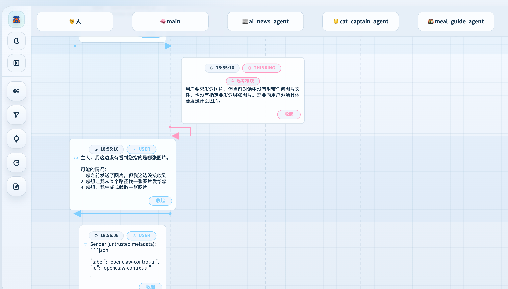

# OpenClaw Sequence Dashboard Plugin

[English](./README.md) | [简体中文](./README.zh-CN.md)

This is an OpenClaw plugin that starts a local dashboard for visualizing multi-agent execution flows.

The dashboard currently provides two read-only views:
- `Overview`: execution groups, issue list, agent activity, and session summary
- `Timeline`: grouped playback for `user -> main`, `sessions_spawn`, and `sessions_send`



## Highlights 

- Reads historical data from `agents/*/sessions/*.jsonl` and updates in real time
- Automatically groups events into executions and generates overview summaries
- Supports filtering by `groupId`, agent, mode, and keyword
- Exposes read-only APIs:
  - `GET /api/overview`
  - `GET /api/executions`
  - `GET /api/executions/:id`
  - `GET /api/history`
  - `GET /api/events`
- Lets you expand or collapse process information such as tool calls, results, and internal steps
- Includes spawn completion fallback handling so child task returns are less likely to be missed

## Installation

```bash
git clone https://github.com/codeth00/openclaw-sequence-ui-plugin /tmp/openclaw-sequence-ui-plugin
cd /tmp/openclaw-sequence-ui-plugin
npm run check
openclaw plugins install /tmp/openclaw-sequence-ui-plugin
node /tmp/openclaw-sequence-ui-plugin/scripts/configure-openclaw.js
openclaw gateway restart
```

Notes:
- Use a writable local directory. `/tmp` is a safe default.
- `openclaw plugins install` requires a local path, so clone first and install from the cloned directory.

## Usage

After installation, open:

- `http://127.0.0.1:8787`

## Verification

```bash
curl http://127.0.0.1:8787/healthz
curl http://127.0.0.1:8787/api/overview
curl 'http://127.0.0.1:8787/api/executions?limit=5'
openclaw gateway status
```

Expected results:
- `healthz` returns `{"ok":true,...}`
- `/api/overview` returns overview JSON
- `/api/executions` returns grouped execution records
- Gateway is listening on `127.0.0.1:18789`
- Dashboard is listening on `127.0.0.1:8787`

## Configuration

Reference: `examples/openclaw.json`

Merge the following into `~/.openclaw/openclaw.json`:

```json
{
  "plugins": {
    "enabled": true,
    "entries": {
      "openclaw-sequence-dashboard-plugin": {
        "enabled": true,
        "config": {
          "host": "127.0.0.1",
          "port": 8787,
          "openclawHome": "~/.openclaw",
          "agentsDir": ""
        }
      }
    }
  }
}
```

Configuration fields:
- `host`: dashboard bind address
- `port`: dashboard port
- `openclawHome`: OpenClaw root directory
- `agentsDir`: optional direct path to the `agents` directory

If installation shows a `child_process` risk warning, that is expected because the plugin starts a local Node sidecar process.

## Local Development

```bash
npm --prefix dashboard-ui install
npm run check
node dashboard/live-dashboard-server.js
```

If you only want to build the frontend:

```bash
npm run build:ui
```

## Repository Layout

- `openclaw.plugin.json`: plugin metadata and config schema
- `index.js`: plugin entry that starts and stops the sidecar service
- `dashboard/live-dashboard-server.js`: session parsing, execution grouping, read-only APIs, and static asset hosting
- `dashboard/dist`: built dashboard assets
- `dashboard-ui`: React + Vite frontend source
- `tests/live-dashboard-server.test.js`: grouping and API contract tests
- `examples/openclaw.json`: example configuration

## Troubleshooting

- If you see `EADDRINUSE`, the port is already occupied. Stop the existing process, or change `plugins.entries.openclaw-sequence-dashboard-plugin.config.port` and restart Gateway.
- If the page shows an older timeline UI, you are probably running an older plugin copy. Reinstall the plugin or start the current repository directly.
- If `/api/overview` returns `404`, the running service is not the current dashboard server.
- If the dashboard is empty, verify that `openclawHome` or `agentsDir` points to a valid `agents/*/sessions` tree.
- If Gateway restarts but the plugin does not load, run `openclaw gateway status` and inspect `~/.openclaw/logs/gateway.log` and `~/.openclaw/logs/gateway.err.log`.

## Official Docs

- Plugin overview: <https://docs.openclaw.ai/plugins/overview>
- Plugin API: <https://docs.openclaw.ai/plugins/plugin-api-reference>
- Gateway configuration: <https://docs.openclaw.ai/gateway/configuration-reference>
